# Claude API 代理服务器

一个高性能的 Claude API 代理服务器，支持多种上游 AI 服务提供商（OpenAI、Gemini、自定义 API），提供负载均衡、多 API 密钥管理和统一入口访问。

## 🚀 功能特性

- **🖥️ 一体化架构**: 后端集成前端，单容器部署，完全替代 Nginx
- **🔐 统一认证**: 一个密钥保护所有入口（前端界面、管理API、代理API）
- **📱 Web 管理面板**: 现代化可视化界面，支持渠道管理、实时监控和配置
- **双 API 支持**: 同时支持 Claude Messages API (`/v1/messages`) 和 Codex Responses API (`/v1/responses`)
- **统一入口**: 通过统一端点访问不同的 AI 服务
- **多上游支持**: 支持 OpenAI (及兼容 API)、Gemini 和 Claude 等多种上游服务
- **🔌 协议转换**: Messages API 支持通过 OpenAI 兼容接口转接到其他 AI 服务
- **负载均衡**: 支持轮询、随机、故障转移策略
- **多 API 密钥**: 每个上游可配置多个 API 密钥，自动轮换使用
- **增强的稳定性**: 内置上游请求超时与重试机制，确保服务在网络波动时依然可靠
- **自动重试与密钥降级**: 检测到额度/余额不足等错误时自动切换下一个可用密钥；若后续请求成功，再将失败密钥移动到末尾（降级）；所有密钥均失败时按上游原始错误返回
- **双重配置**: 支持命令行工具和 Web 界面管理上游配置
- **环境变量**: 通过 `.env` 文件灵活配置服务器参数
- **健康检查**: 内置健康检查端点和实时状态监控
- **日志系统**: 完整的请求/响应日志记录
- **📡 支持流式和非流式响应**
- **🛠️ 支持工具调用**
- **💬 会话管理**: Responses API 支持多轮对话的会话跟踪和上下文保持

## 🏗️ 架构设计

项目采用一体化架构，单容器部署，完全替代 Nginx：

```
用户 → 后端:3000 →
     ├─ / → 前端界面（需要密钥）
     ├─ /api/* → 管理API（需要密钥）
     ├─ /v1/messages → Claude Messages API 代理（需要密钥）
     └─ /v1/responses → Codex Responses API 代理（需要密钥）
```

**核心优势**: 单端口、统一认证、无跨域问题、资源占用低

> 📚 详细架构设计和技术选型请参考 [ARCHITECTURE.md](ARCHITECTURE.md)

## 🏁 快速开始

### 📦 推荐部署方式

我们**强烈推荐**以下两种方式部署，它们经过充分测试，性能优异：

| 部署方式 | 启动时间 | 内存占用 | 适用场景 |
|---------|---------|---------|---------|
| **🐳 Docker** | ~2s | ~25MB | 生产环境、一键部署 |
| **🚀 Go 版本** | <100ms | ~20MB | 高性能、原生部署 |
| 🔧 Node.js/Bun | ~1s | ~50MB | 开发调试（备用） |

---

### 方式一：🐳 Docker 部署（推荐）

**适合所有用户，无需安装依赖，一键启动**

```bash
# 1. 克隆项目
git clone https://github.com/BenedictKing/claude-proxy
cd claude-proxy

# 2. 配置环境变量（重要！）
cp backend-go/.env.example backend-go/.env
# 编辑 backend-go/.env 设置强密钥：PROXY_ACCESS_KEY=your-super-strong-secret-key

# 3. 启动服务（国内用户使用 Dockerfile_China）
docker-compose up -d
```

访问地址：
- **Web管理界面**: http://localhost:3000
- **Messages API 端点**: http://localhost:3000/v1/messages
- **Responses API 端点**: http://localhost:3000/v1/responses
- **健康检查**: http://localhost:3000/health

---

### 方式二：🚀 Go 原生部署（推荐）

**适合追求极致性能的用户，启动时间 <100ms**

```bash
# 1. 克隆项目
git clone https://github.com/BenedictKing/claude-proxy
cd claude-proxy

# 2. 配置环境变量
cp backend-go/.env.example backend-go/.env
# 编辑 backend-go/.env 文件，设置你的配置

# 3. 构建并启动（自动构建前端+后端）
make build-current
cd backend-go && ./dist/claude-proxy
```

**或使用 Makefile 快捷命令：**

```bash
cd backend-go
make help          # 查看所有可用命令
make dev           # 开发模式（热重载）
make build-run     # 构建并运行
```

> 📚 Go 版本配置管理详见 `cd backend-go && make help`

---

### 方式三：🔧 Node.js/Bun 部署（备用）

**仅推荐用于开发调试，生产环境请使用 Docker 或 Go 版本**

<details>
<summary>点击展开 Node.js/Bun 部署说明</summary>

#### 前置要求

- Node.js 18+ 或 Bun
- 包管理器：支持 pnpm、npm 或 bun

#### 安装步骤

1. 克隆项目

```bash
git clone https://github.com/BenedictKing/claude-proxy
cd claude-proxy
```

2. 安装依赖

```bash
bun install
```

3. 配置环境变量

```bash
cp backend/.env.example backend/.env
# 编辑 backend/.env 文件，设置你的配置
```

**重要**: 修改 `PROXY_ACCESS_KEY` 为强密钥！

4. 启动服务器

#### 开发模式

```bash
# 前后端同时启动，支持热重载
bun run dev
```

#### 生产模式

```bash
# 构建项目（会同时构建前后端）
bun run build

# 启动服务器（必须在项目根目录执行）
bun run start
```

**重要提示**：
- ✅ 构建命令会自动验证前后端构建产物
- ✅ 启动命令必须在项目根目录（claude-proxy/）执行
- ✅ 前端资源会自动从 `frontend/dist` 加载
- ⚠️  如果遇到 "前端资源未找到" 错误，请重新运行 `bun run build`

访问地址：
- **Web管理界面**: http://localhost:3000
- **Messages API 端点**: http://localhost:3000/v1/messages
- **Responses API 端点**: http://localhost:3000/v1/responses
- **健康检查**: http://localhost:3000/health

</details>

## 🐳 Docker 部署 (推荐)

### 一键部署

```bash
# 克隆项目
git clone https://github.com/BenedictKing/claude-proxy
cd claude-proxy

# 修改配置（重要！）
cp backend/.env.example backend/.env
# 编辑 .env 设置强密钥：PROXY_ACCESS_KEY=your-super-strong-secret-key

# 启动服务
docker-compose up -d
```

### 自定义部署

```yaml
# docker-compose.yml
services:
  claude-proxy:
    build:
      context: .
      dockerfile: Dockerfile_China  # 国内网络使用
    container_name: claude-proxy
    ports:
      - "3000:3000"  # 统一端口
    environment:
      - NODE_ENV=production
      - ENABLE_WEB_UI=true  # true=一体化, false=纯API
      - PROXY_ACCESS_KEY=your-super-strong-secret-key
      - LOG_LEVEL=info
    volumes:
      - ./.config:/app/.config  # 配置持久化
      - ./logs:/app/logs        # 日志持久化
    restart: unless-stopped
```

### 云平台一键部署

#### Railway 部署
```bash
# 1. 连接 GitHub 仓库到 Railway
# 2. 设置环境变量
PROXY_ACCESS_KEY=your-super-strong-secret-key
ENABLE_WEB_UI=true
NODE_ENV=production
PORT=3000

# 3. 自动部署完成
# 访问：https://your-app.railway.app
```

#### Render 部署
```bash
# 1. 选择 Docker 服务类型
# 2. 连接 GitHub 仓库
# 3. 设置环境变量：
#    PROXY_ACCESS_KEY=your-super-strong-secret-key
#    ENABLE_WEB_UI=true
#    NODE_ENV=production
# 4. 自动构建和部署
```

#### Fly.io 部署
```bash
# 快速部署
fly launch --dockerfile Dockerfile
fly secrets set PROXY_ACCESS_KEY=your-super-strong-secret-key
fly secrets set ENABLE_WEB_UI=true
fly deploy

# 查看状态
fly status
fly logs
```

#### Zeabur 部署
```bash
# 1. 连接 GitHub 仓库
# 2. 自动检测 Docker 项目
# 3. 设置环境变量
# 4. 一键部署
```

## 🔧 配置管理

**两种配置方式**:
1. **Web界面** (推荐): 访问 `http://localhost:3000` → 输入密钥 → 可视化管理
2. **命令行工具**: `cd backend && bun run config --help`

> 📚 环境变量配置详见 [ENVIRONMENT.md](ENVIRONMENT.md)

## 🔐 安全配置

### 统一访问控制

所有访问入口均受 `PROXY_ACCESS_KEY` 保护：

1. **前端管理界面** (`/`) - 通过查询参数或本地存储验证密钥
2. **管理API** (`/api/*`) - 需要 `x-api-key` 请求头
3. **代理API** (`/v1/messages`) - 需要 `x-api-key` 请求头
4. **健康检查** (`/health`) - 公开访问，无需密钥

### 认证流程

```mermaid
flowchart TD
    A[用户访问] --> B{是否为健康检查?}
    B -->|是| C[直接访问]
    B -->|否| D{提供了密钥?}
    D -->|否| E[显示认证页面]
    D -->|是| F{密钥是否正确?}
    F -->|否| G[返回401错误]
    F -->|是| H[允许访问]
    E --> I[用户输入密钥]
    I --> F
```



### 生产环境安全清单

```bash
# 1. 生成强密钥 (必须!)
PROXY_ACCESS_KEY=$(openssl rand -base64 32)
echo "生成的密钥: $PROXY_ACCESS_KEY"

# 2. 生产环境配置
NODE_ENV=production
ENABLE_REQUEST_LOGS=false
ENABLE_RESPONSE_LOGS=false
LOG_LEVEL=warn
ENABLE_WEB_UI=true

# 3. 网络安全
# - 使用 HTTPS (推荐 Cloudflare CDN)
# - 配置防火墙规则
# - 定期轮换访问密钥
# - 启用访问日志监控
```

### 密钥管理最佳实践

```bash
# 密钥轮换
echo "旧密钥: $OLD_PROXY_ACCESS_KEY"
echo "新密钥: $NEW_PROXY_ACCESS_KEY"

# 更新环境变量
export PROXY_ACCESS_KEY=$NEW_PROXY_ACCESS_KEY

# 重启服务
docker-compose restart claude-proxy
```

## 📖 API 使用

本服务支持两种 API 格式：

1. **Messages API** (`/v1/messages`) - 标准的 Claude API 格式
2. **Responses API** (`/v1/responses`) - Codex 格式，支持会话管理

### Messages API - 标准 Claude API 调用

```bash
curl -X POST http://localhost:3000/v1/messages \
  -H "x-api-key: your-proxy-access-key" \
  -H "Content-Type: application/json" \
  -d '{
    "model": "claude-3-5-sonnet-20241022",
    "max_tokens": 100,
    "messages": [
      {"role": "user", "content": "Hello!"}
    ]
  }'
```

### 流式响应

```bash
curl -X POST http://localhost:3000/v1/messages \
  -H "x-api-key: your-proxy-access-key" \
  -H "Content-Type: application/json" \
  -d '{
    "model": "claude-3-5-sonnet-20241022",
    "stream": true,
    "max_tokens": 100,
    "messages": [
      {"role": "user", "content": "Count to 10"}
    ]
  }'
```

### 工具调用

```bash
curl -X POST http://localhost:3000/v1/messages \
  -H "x-api-key: your-proxy-access-key" \
  -H "Content-Type: application/json" \
  -d '{
    "model": "claude-3-5-sonnet-20241022",
    "max_tokens": 1000,
    "tools": [
      {
        "name": "get_weather",
        "description": "获取指定城市的天气信息",
        "input_schema": {
          "type": "object",
          "properties": {
            "city": {"type": "string", "description": "城市名称"}
          },
          "required": ["city"]
        }
      }
    ],
    "messages": [
      {"role": "user", "content": "北京今天天气怎么样？"}
    ]
  }'
```

### Responses API - Codex 格式调用

Responses API 支持会话管理和多轮对话，自动跟踪上下文：

#### 基础调用

```bash
curl -X POST http://localhost:3000/v1/responses \
  -H "x-api-key: your-proxy-access-key" \
  -H "Content-Type: application/json" \
  -d '{
    "model": "gpt-5",
    "max_tokens": 100,
    "input": "你好！请介绍一下你自己。"
  }'
```

#### 多轮对话（会话跟踪）

```bash
# 第一轮对话
RESPONSE_ID=$(curl -s -X POST http://localhost:3000/v1/responses \
  -H "x-api-key: your-proxy-access-key" \
  -H "Content-Type: application/json" \
  -d '{
    "model": "gpt-5",
    "max_tokens": 100,
    "input": "我的名字是张三"
  }' | jq -r '.id')

# 第二轮对话（基于上一轮）
curl -X POST http://localhost:3000/v1/responses \
  -H "x-api-key: your-proxy-access-key" \
  -H "Content-Type: application/json" \
  -d "{
    \"model\": \"gpt-5\",
    \"max_tokens\": 100,
    \"input\": \"你还记得我的名字吗？\",
    \"previous_response_id\": \"$RESPONSE_ID\"
  }"
```

#### 流式响应

```bash
curl -X POST http://localhost:3000/v1/responses \
  -H "x-api-key: your-proxy-access-key" \
  -H "Content-Type: application/json" \
  -d '{
    "model": "gpt-5",
    "stream": true,
    "max_tokens": 200,
    "input": "从1数到10"
  }'
```

#### 会话参数说明

- **`input`**: 用户输入（字符串或数组）
- **`previous_response_id`**: 上一轮响应的 ID，用于多轮对话
- **`store`**: 是否存储会话（默认 `true`）
- **`stream`**: 是否启用流式响应（默认 `false`）
- **响应字段**:
  - `id`: 响应 ID（用于下一轮对话）
  - `previous_id`: 上一轮响应 ID
  - `output`: 模型输出内容
  - `usage`: Token 使用统计

### 管理API

```bash
# 获取渠道列表
curl -H "x-api-key: your-proxy-access-key" \
  http://localhost:3000/api/channels

# 测试渠道连通性
curl -H "x-api-key: your-proxy-access-key" \
  http://localhost:3000/api/ping
```

## 🔌 协议转换能力

### Messages API 多协议支持

本代理服务器的 Messages API 端点 (`/v1/messages`) 支持多种上游协议转换：

**支持的上游服务**:
- ✅ **Claude API** (Anthropic) - 原生支持，直接透传
- ✅ **OpenAI API** - 自动转换 Claude 格式 ↔ OpenAI 格式
- ✅ **OpenAI 兼容 API** - 支持所有兼容 OpenAI 格式的服务
- ✅ **Gemini API** (Google) - 自动转换 Claude 格式 ↔ Gemini 格式

**核心优势**:
- 🔄 **统一接口**: 客户端只需使用 Claude Messages API 格式
- 🎯 **自动转换**: 代理自动处理不同上游的协议差异
- 🔌 **即插即用**: 无需修改客户端代码即可切换上游服务
- 💰 **成本优化**: 灵活切换不同价格的 AI 服务

**示例**: 使用 Claude API 格式调用 OpenAI GPT-4
```bash
curl -X POST http://localhost:3000/v1/messages \
  -H "x-api-key: your-proxy-access-key" \
  -H "Content-Type: application/json" \
  -d '{
    "model": "claude-3-5-sonnet-20241022",
    "max_tokens": 100,
    "messages": [
      {"role": "user", "content": "Hello!"}
    ]
  }'
# 后端自动转换并发送到配置的 OpenAI 上游
```

## 🧪 测试验证

### 快速验证脚本

创建 `test-proxy.sh` 测试脚本：

```bash
#!/bin/bash
set -e

PROXY_URL="http://localhost:3000"
API_KEY="your-proxy-access-key"

echo "🏥 测试健康检查..."
curl -s "$PROXY_URL/health" | jq .

echo "\n🔒 测试无密钥访问 (应该失败)..."
curl -s "$PROXY_URL/api/channels" || echo "✅ 正确拒绝无密钥访问"

echo "\n🔑 测试API访问 (应该成功)..."
curl -s -H "x-api-key: $API_KEY" "$PROXY_URL/api/channels" | jq .

echo "\n💬 测试Claude API代理..."
curl -s -X POST "$PROXY_URL/v1/messages" \
  -H "x-api-key: $API_KEY" \
  -H "Content-Type: application/json" \
  -d '{
    "model": "claude-3-5-sonnet-20241022",
    "max_tokens": 50,
    "messages": [{"role": "user", "content": "Hello"}]
  }' | jq .

echo "\n✅ 所有测试完成！"
```

```bash
# 运行测试
chmod +x test-proxy.sh
./test-proxy.sh
```

### 集成测试

```bash
# Claude Code CLI 集成测试
# 1. 配置 Claude Code 使用本地代理
export ANTHROPIC_API_URL="http://localhost:3000"
export ANTHROPIC_API_KEY="your-proxy-access-key"

# 2. 测试基础对话
echo "测试Claude Code集成..." | claude-code

# 3. 测试工具调用
echo "请帮我查看当前目录的文件" | claude-code
```

## 📊 监控和日志

### 健康检查

```bash
# 健康检查端点 (无需认证)
GET /health

# 返回示例
{
  "status": "healthy",
  "timestamp": "2024-01-01T00:00:00.000Z",
  "uptime": 3600,
  "mode": "production",
  "config": {
    "upstreamCount": 3,
    "currentUpstream": "openai",
    "loadBalance": "round-robin"
  }
}
```

### 服务状态监控

```bash
# Docker 容器状态
docker-compose ps
docker-compose logs -f claude-proxy

# 性能监控
docker stats claude-proxy

# 存储使用
du -sh .config/ logs/
```

### 日志级别

```bash
LOG_LEVEL=debug  # debug, info, warn, error
ENABLE_REQUEST_LOGS=true   # 记录请求日志
ENABLE_RESPONSE_LOGS=true  # 记录响应日志
```

## 🔧 故障排除

### 常见问题

1. **认证失败**
   ```bash
   # 检查密钥设置
   echo $PROXY_ACCESS_KEY

   # 验证密钥格式
   curl -H "x-api-key: $PROXY_ACCESS_KEY" http://localhost:3000/health
   ```

2. **容器启动失败**
   ```bash
   # 检查日志
   docker-compose logs claude-proxy

   # 检查端口占用
   lsof -i :3000
   ```

3. **前端界面无法访问 - "前端资源未找到"**

   **原因**: 前端构建产物不存在或路径不正确

   **解决方案**:

   ```bash
   # 方案1: 重新构建（推荐）
   bun run build
   bun run start

   # 方案2: 验证构建产物是否存在
   # Windows
   dir frontend\dist\index.html

   # Linux/Mac
   ls -la frontend/dist/index.html

   # 方案3: 检查工作目录
   # 确保在项目根目录（claude-proxy/）执行启动命令
   pwd  # 应该显示 .../claude-proxy
   bun run start

   # 方案4: 临时禁用Web UI
   # 编辑 backend/.env 文件
   ENABLE_WEB_UI=false
   # 然后只使用API端点: /v1/messages
   ```

4. **Docker环境前端404**
   ```bash
   # 检查 ENABLE_WEB_UI 设置
   docker-compose exec claude-proxy printenv ENABLE_WEB_UI

   # 检查文件路径（Docker内部会自动复制到正确位置）
   docker-compose exec claude-proxy ls -la /app/frontend/dist/

   # 重新构建镜像
   docker-compose build --no-cache
   docker-compose up -d
   ```

### 重置配置

```bash
# 停止服务
docker-compose down

# 清理配置文件
rm -rf .config/*

# 重新启动
docker-compose up -d
```

## 🔄 更新升级

```bash
# 获取最新代码
git pull origin main

# 重新构建并启动
docker-compose up -d --build
```

## 📖 使用指南

### 命令行配置工具
```bash
cd backend-go && make help
```

### 相关文档
- **📐 架构设计**: [ARCHITECTURE.md](ARCHITECTURE.md) - 技术选型、设计模式、数据流
- **⚙️ 环境配置**: [ENVIRONMENT.md](ENVIRONMENT.md) - 环境变量、配置场景、故障排除
- **🔨 开发指南**: [DEVELOPMENT.md](DEVELOPMENT.md) - 开发流程、调试技巧、最佳实践
- **🤝 贡献规范**: [CONTRIBUTING.md](CONTRIBUTING.md) - 提交规范、代码质量标准
- **📝 版本历史**: [CHANGELOG.md](CHANGELOG.md) - 完整变更记录和升级指南
- **🚀 发布流程**: [RELEASE.md](RELEASE.md) - 维护者发布流程

## 📄 许可证

本项目基于 MIT 许可证开源 - 查看 [LICENSE](LICENSE) 文件了解详情。

## 🙏 致谢

- [Anthropic](https://www.anthropic.com/) - Claude API
- [OpenAI](https://openai.com/) - GPT API
- [Google](https://cloud.google.com/vertex-ai) - Gemini API
- [Bun](https://bun.sh/) - 高性能 JavaScript 运行时